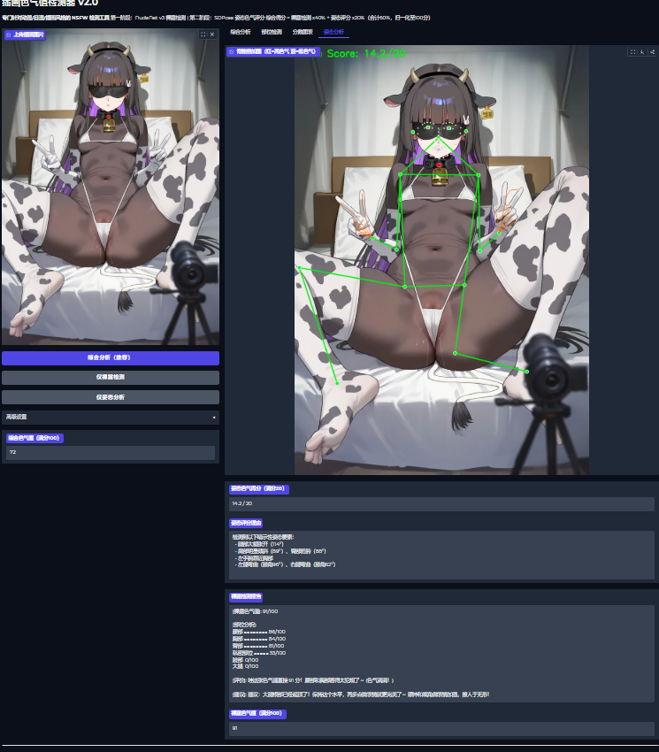
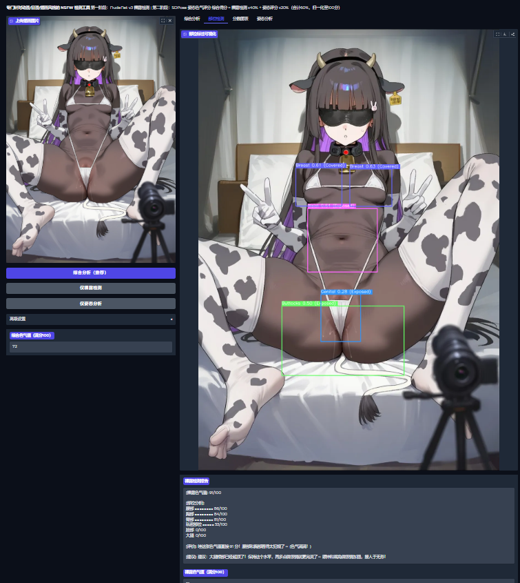

# 二次元插画色气值检测系统 v2.1 (Anime Illustration NSFW Evaluator)

一个专门针对二次元插画/动漫/艺术风格图像的「色气程度检测系统」，集成裸露检测与姿态/动作色气评分，提供全面的色气值分析。

## ✨ 功能特性

- **双模块评分系统**: 裸露检测（40%）+ 姿态色气评分（30%），综合归一化至 0-100 分
- **裸露部位分析**: 检测脸部、胸部、臀部、大腿、腰部、私密部位的具体色气值
- **姿态动作分析**: 基于 SDPose-Wholebody 133关键点，分析腿部张开、背弓、肩臀倾斜、手部位置等8大维度
- **口语化评价**: 像朋友聊天一样的轻松调侃风格评价
- **改进建议**: 每张图片都会提供具体的绘画改进建议
- **可视化界面**: 基于 Gradio 的 Web UI，支持拖拽上传和实时结果显示
- **动漫优化**: 专门针对二次元插画优化的检测算法，使用 SDPose-Wholebody 提升动漫风格识别精度

## 🛠️ 技术栈

- **Python 3.10+** - 核心编程语言
- **NudeNet v3** - 身体部位检测（针对插画优化）
- **NSFW Image Detector (EVA ViT)** - 总体色气值分类器
- **SDPose-Wholebody** - 姿态关键点检测（133点，动漫风格优化）
- **YOLO11-x** - 人体检测器
- **Gradio** - Web 用户界面
- **OpenCV & PIL** - 图像处理
- **PyTorch & Transformers** - 深度学习框架

## 📁 项目结构

\`
img_evaluator/
- ├── src/                    # 核心源代码
- │   ├── inference.py       # 主推理模块（裸露检测）
- │   ├── pose_module.py     # 姿态评分模块（SDPose-Wholebody版）
- │   ├── config.py          # 配置文件
- │   ├── model_manager.py   # 模型管理器
- │   └── __init__.py
- ├── utils/                 # 工具函数
- │   ├── image_processor.py # 图像处理
- │   ├── score_calculator.py # 分数计算
- │   ├── comment_generator.py # 评价生成
- │   ├── visualization.py   # 可视化工具
- │   └── __init__.py
- ├── gradio_app/            # Web UI 界面
- │   ├── app.py            # Gradio 应用（v2.1，双模块融合）
- │   └── __init__.py
- ├── models/               # 模型存储目录
- │   ├── SDPose-OOD/      # SDPose 代码库（GitHub clone）
- │   └── SDPose-Wholebody/ # SDPose 权重文件（HuggingFace）
- ├── examples/             # 示例图片
- │   ├── high_score/      # 高分示例图片
- │   └── low_score/       # 低分示例图片
- ├── start_gradio.py      # Web UI 启动脚本
- ├── requirements.txt     # Python 依赖（已更新SDPose依赖）
- ├── MODEL_DOWNLOAD.md    # 模型下载说明（含SDPose详细指引）
- └── README.md           # 项目说明（本文件）
\`

## 🚀 快速开始

### 1. 环境准备

\`ash
# 克隆项目
- git clone https://github.com/peknic/NSFW_Illus_evaluator.git
- cd img_evaluator

# 创建虚拟环境（推荐）
python -m venv .venv

# 激活虚拟环境
# Windows:
.venv\\Scripts\\activate
# Linux/Mac:
source .venv/bin/activate

# 安装依赖
pip install -r requirements.txt
\`

### 2. 下载模型

\`ash
# 自动下载 NSFW 分类器模型
python -m src.model_manager

# 下载 SDPose-Wholebody 模型（详见 MODEL_DOWNLOAD.md）
# 1. 克隆 SDPose-OOD 代码库
git clone https://github.com/t-s-liang/SDPose-OOD.git models/SDPose-OOD

# 2. 下载 SDPose-Wholebody 权重（需 huggingface-hub）
pip install huggingface-hub
huggingface-cli download teemosliang/SDPose-Wholebody --local-dir models/SDPose-Wholebody
\`

### 3. 启动 Web UI

\`ash
python start_gradio.py
\`

访问 \http://localhost:7861\ 使用图形界面。

### 4. 命令行使用

\`ash
# 单张图片分析
python main.py --image examples/high_score/1234.jpg

# 批量分析目录
python main.py --dir path/to/images
\`

## ⚙️ 配置说明

主要配置在 \src/config.py\ 和 \src/pose_module.py\ 中：

- **裸露检测权重**: 调整各部位对裸露分数的影响
- **姿态评分权重**: 8大维度（腿部张开、背弓、肩臀倾斜、手部位置、面部倾斜、S曲线、动态姿势、躺卧姿势）各维度权重
- **综合分数公式**: 裸露分(0~100) × 40% + 姿态分(0~30) × 100% × 30%，归一化至100分
- **检测阈值**: 控制身体部位检测和姿态关键点检测的灵敏度
- **可视化设置**: 检测框颜色和骨骼热力图样式

\`python
# 姿态评分维度（src/pose_module.py）
评分维度 = {
    "腿部张开": 0-5分,    # 髋-膝-膝夹角 >100° 满分
    "背弓评分": 0-4分,    # 髋中点偏离肩-踝直线程度
    "肩臀倾斜": 0-4分,    # 肩线/臀线水平倾斜度
    "手部位置": 0-5分,    # 手腕/手指靠近腰胯/胸部
    "面部倾斜": 0-3分,    # 头部仰视/倾斜角度
    "S型曲线": 0-4分,     # 肩-髋-踝横向偏移量
    "动态姿势": 0-3分,    # 膝弯曲、手臂伸展
    "躺卧姿势": 0-3分,    # 肩髋连线水平程度
}
\`

## 📊 输出示例

\`
综合色气值: 78/100
- ├── 裸露检测: 65/100 (权重40%)
- │   ├── 脸部: ■■■■■■■ 70/100
- │   ├── 胸部: ■■■■■■■■ 85/100  
- │   ├── 臀部: ■■■■■■ 60/100
- │   ├── 大腿: ■■■■■ 50/100
- │   ├── 腰部: ■■■■■■■ 72/100
- │   └── 私密部位: ■■■ 30/100
- └── 姿态评分: 22/30 (权重30%)
-    ├── 腿部张开: 4.5/5 (大幅张开)
-    ├── 背弓评分: 3.2/4 (明显背弓)
-    ├── 肩臀倾斜: 2.8/4 (臀部扭胯)
-    ├── 手部位置: 3.5/5 (手腕靠近腰胯)
-    ├── 面部倾斜: 2.0/3 (头部仰视)
-    ├── S型曲线: 2.5/4 (轻度S型)
-    ├── 动态姿势: 1.8/3 (膝部弯曲)
-    └── 躺卧姿势: 1.7/3 (半躺姿态)

评价: 这张插画色气值 78 分！姿态设计很有暗示性，腿部张开和背弓都很到位～
改进建议: 可以进一步强化手部位置和面部表情的暗示性
\`

## 🔧 核心算法

1. **图像预处理**: 动态调整分辨率，保留插画细节
2. **双模块并行检测**: 
   - 裸露检测: NudeNet v3（部位检测）+ NSFW 分类器
   - 姿态检测: YOLO11-x（人体检测）→ SDPose-Wholebody（133关键点）
3. **姿态评分引擎**: 基于133关键点的8维度规则打分（阈值优化版）
4. **分数融合**: 裸露分 × 40% + 姿态分 × 30%，归一化至100分
5. **动漫优化**: 针对二次元图片调整检测阈值，使用 SDPose-Wholebody 提升动漫风格识别精度
6. **评价生成**: 基于分数和部位数据生成自然语言评价

## 🐛 已知限制

- 对抽象艺术风格插画检测效果有限
- 多人物重叠场景可能漏检部分部位
- 低分辨率图片（<512px）检测精度下降
- 黑白线稿检测效果较差

## 🎯 版本更新 v2.1

### ✅ 已完成优化
- **SDPose-Wholebody 集成**: 替换原 DWPose，133关键点专为动漫风格优化
- **姿态评分引擎优化**: 8大维度阈值降低，总分上限20→30分
- **检测率提升**: 置信度阈值0.3→0.2，YOLO失败自动重试全图推理
- **权重调整**: 姿态评分权重20%→30%，综合影响增强
- **人物选择优化**: 选择平均置信度最高的人物而非第一个

### 🔄 未来优化方向
- 进一步降低误报率
- 支持更多动漫风格变体
- 实时视频流分析
- 批量处理性能优化

## 📄 许可证

本项目仅供学习和研究使用，请勿用于商业用途或非法场景。

## 🤝 贡献指南

1. Fork 本项目
2. 创建功能分支 (\git checkout -b feature/amazing-feature\)
3. 提交更改 (\git commit -m 'Add amazing feature'\)
4. 推送到分支 (\git push origin feature/amazing-feature\)
5. 开启 Pull Request

**注意**: 本项目专门为插画/动漫风格优化，对真人照片的检测效果可能不同。使用时请遵守当地法律法规和道德规范。
