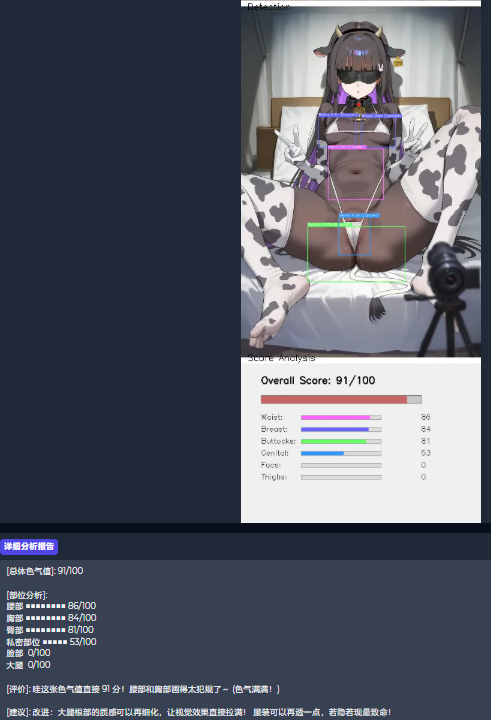

# 插画色气值检测工具 (Illustration NSFW Evaluator)

一个专门针对插画/动漫/日漫风格的「色气程度检测工具」，能够自动分析图片的色气值并提供改进建议。

## ✨ 功能特性

- **智能评分系统**: 输入插画图片，输出 0-100 分的总体色气值
- **部位分析**: 检测脸部、胸部、臀部、大腿、腰部、私密部位的具体色气值
- **口语化评价**: 像朋友聊天一样的轻松调侃风格评价
- **改进建议**: 每张图片都会提供具体的绘画改进建议
- **可视化界面**: 基于 Gradio 的 Web UI，支持拖拽上传和实时结果显示
- **动漫优化**: 专门针对二次元插画优化的检测算法

## 🛠️ 技术栈

- **Python 3.10+** - 核心编程语言
- **NudeNet v3** - 身体部位检测（针对插画优化）
- **NSFW Image Detector (EVA ViT)** - 总体色气值分类器
- **Gradio** - Web 用户界面
- **OpenCV & PIL** - 图像处理
- **PyTorch & Transformers** - 深度学习框架

## 📁 项目结构

\`
img_evaluator/
- ├── src/                    # 核心源代码
- │   ├── inference.py       # 主推理模块
- │   ├── config.py          # 配置文件
- │   ├── model_manager.py   # 模型管理器
- │   └── __init__.py
- ├── utils/                 # 工具函数
- │   ├── image_processor.py # 图像处理
- │   ├── score_calculator.py # 分数计算
- │   ├── comment_generator.py # 评价生成
- │   ├── visualization.py   # 可视化工具
- │   └── __init__.py
- ├── gradio_app/            # Web UI 界面
- │   ├── app.py            # Gradio 应用
- │   ├── components.py     # UI 组件
- │   └── __init__.py
- ├── models/               # 模型存储目录
- ├── examples/             # 示例图片
- │   └── high_score/      # 高分示例图片
- ├── tests/               # 单元测试
- ├── main.py              # 命令行入口
- ├── start_gradio.py      # Web UI 启动脚本
- ├── requirements.txt     # Python 依赖
- ├── MODEL_DOWNLOAD.md    # 模型下载说明
- └── README.md           # 项目说明（本文件）
\`

## 🚀 快速开始

### 1. 环境准备

\`ash
# 克隆项目
git clone <repository-url>
cd img_evaluator

# 创建虚拟环境（推荐）
python -m venv .venv

# 激活虚拟环境
# Windows:
.venv\\Scripts\\activate
# Linux/Mac:
source .venv/bin/activate

# 安装依赖
pip install -r requirements.txt
\`

### 2. 下载模型

\`ash
# 自动下载 NSFW 分类器模型
python -m src.model_manager

# 或手动下载（详见 MODEL_DOWNLOAD.md）
# NudeNet v3 模型会自动下载
\`

### 3. 启动 Web UI

\`ash
python start_gradio.py
\`

访问 \http://localhost:7861\ 使用图形界面。

### 4. 命令行使用

\`ash
# 单张图片分析
python main.py --image examples/high_score/1234.jpg

# 批量分析目录
python main.py --dir path/to/images
\`

## ⚙️ 配置说明

主要配置在 \src/config.py\ 中：

- **部位权重**: 调整各部位对最终分数的影响
- **检测阈值**: 控制身体部位检测的灵敏度
- **分数计算参数**: NSFW 分类器和部位检测的权重比例
- **可视化设置**: 检测框颜色和样式

\`python
# 示例：调整检测灵敏度
PART_THRESHOLD_ADJUSTMENTS = {
    'face': 0.4,      # 脸部阈值降低 60%
    'breast': 0.3,    # 胸部阈值降低 70%
    'buttocks': 0.5,  # 臀部阈值降低 50%
    # ...
}
\`

## 📊 输出示例

\`
- 图片分析结果：
- 总体色气值: 89/100
- 部位得分:
  * 腰部 ■■■■■■■■ 86/100
  * 胸部 ■■■■■■■■ 84/100
  * 臀部 ■■■■■■■■ 81/100
  * 私密部位 ■■■■■ 53/100
- 评价: 哇这张色气值直接 89 分！胸部画得太犯规了～
- 改进建议: 可以适当降低胸部尺寸，增加一些衣物细节
\`

## 🔧 核心算法

1. **图像预处理**: 动态调整分辨率，保留插画细节
2. **并行检测**: 同时运行 NudeNet v3（部位检测）和 NSFW 分类器
3. **分数融合**: 结合部位检测结果和 NSFW 分类器输出
4. **动漫优化**: 针对二次元图片调整检测阈值和分数计算
5. **评价生成**: 基于分数和部位数据生成自然语言评价

## 🐛 已知限制

- 对抽象艺术风格插画检测效果有限
- 多人物重叠场景可能漏检部分部位
- 低分辨率图片（<512px）检测精度下降
- 黑白线稿检测效果较差

## 🎯 优化方向

- ✅ 小胸部检测优化
- ✅ 脸部和私密部位阈值调整
- ✅ 多人物场景检测优化
- 🔄 进一步降低误报率
- 🔄 支持更多动漫风格

## 📄 许可证

本项目仅供学习和研究使用，请勿用于商业用途或非法场景。

## 🤝 贡献指南

1. Fork 本项目
2. 创建功能分支 (\git checkout -b feature/amazing-feature\)
3. 提交更改 (\git commit -m 'Add amazing feature'\)
4. 推送到分支 (\git push origin feature/amazing-feature\)
5. 开启 Pull Request

**注意**: 本项目专门为插画/动漫风格优化，对真人照片的检测效果可能不同。使用时请遵守当地法律法规和道德规范。
